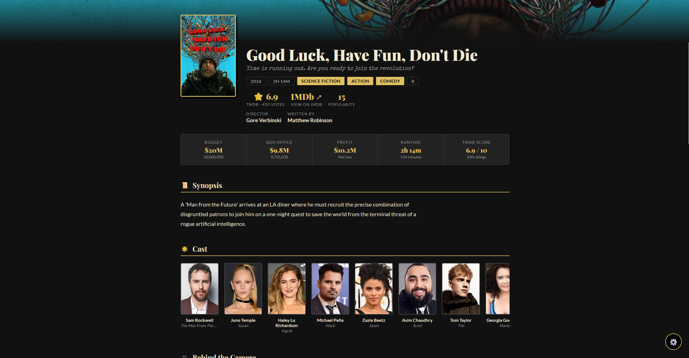

<div align="center">

# 🎭 The Marquee

**A cinematic movie lookup app. Search any film, get the full picture.**

[](https://ai9an.github.io/marquee/)
[](https://www.themoviedb.org)
[](LICENSE)



</div>

---

## ✨ Features

- 🔍 **Instant search** with autocomplete and poster thumbnails
- 🎬 **Full movie insights** — director, cast, crew, budget, box office, trailers and more
- 🌟 **Cast strip** with photos and character names (horizontal scroll)
- 🎥 **Behind the camera** — crew cards with profile photos sorted by role importance
- 💰 **Quick facts bar** — budget, box office, profit, runtime and score at a glance
- 🎭 **Similar movies** — clickable recommendations
- ▶️ **Trailers** — opens YouTube directly
- 🎨 **4 themes** — Classic (theatre tan), Noir, Velvet, Silver
- 🔤 **Font picker + size slider** — 5 font options, fully adjustable
- 💾 **Persists everything** — API key, theme, font all saved in localStorage
- 📄 **Single file** — one `index.html`, no build step, no dependencies

---

## 🚀 Getting Started

### 1. Get a TMDB API Key

Sign up for a free account at [themoviedb.org](https://www.themoviedb.org/signup) and grab your **v3 API key** from:

> Account → Settings → [API](https://www.themoviedb.org/settings/api)

It's free. Takes about 2 minutes.

### 2. Deploy to GitHub Pages

```bash
# Clone or fork this repo
git clone https://github.com/your-username/the-marquee.git
cd the-marquee

# That's it — it's a single HTML file
```

Then in your repo:

1. Go to **Settings → Pages**
2. Set source to **Deploy from a branch**
3. Select **main** branch, **/ (root)**
4. Hit **Save**

Your site will be live at `https://your-username.github.io/the-marquee`

### 3. Add Your API Key

Open the app, hit the **⚙️** button in the bottom right, paste your TMDB API key and save. Done.

---

## 📋 What You Get on Each Movie

| Section | Details |
|---|---|
| **Hero** | Backdrop image, poster, title, tagline, genres, rating, certification |
| **Director & Writers** | Shown immediately under the title |
| **Quick Facts** | Budget, box office, profit, runtime, TMDB score |
| **Synopsis** | Full overview |
| **Cast** | Top 20 cast members with photos and character names |
| **Behind the Camera** | Director, DP, composer, writers, producers, editor — with profile photos |
| **Trailers** | YouTube thumbnails, opens in new tab |
| **Production Details** | Studio, country, language, release date, collection |
| **Similar Movies** | 12 clickable recommendations |

---

## ⚙️ Settings

| Setting | Options |
|---|---|
| **TMDB API Key** | Stored in localStorage, never leaves your browser |
| **Theme** | 🎭 Classic · 🕵️ Noir · 💜 Velvet · 🌫️ Silver |
| **Font** | Lato · Inter · DM Sans · Source Serif 4 · IBM Plex Mono |
| **Font Size** | 13px – 22px slider |

---

## 🛠️ Tech

- **Zero dependencies** — vanilla HTML, CSS, JS
- **TMDB API v3** — movie data, images, credits, videos
- **Google Fonts** — Playfair Display, Special Elite, Lato + more
- **localStorage** — for persisting user preferences
- **GitHub Pages** — static hosting, free

---

## 📝 License

MIT — do whatever you want with it.

---

<div align="center">

Built with ☕ and a love for movies &nbsp;·&nbsp; Data from [TMDB](https://www.themoviedb.org)

*This product uses the TMDB API but is not endorsed or certified by TMDB.*

</div>
